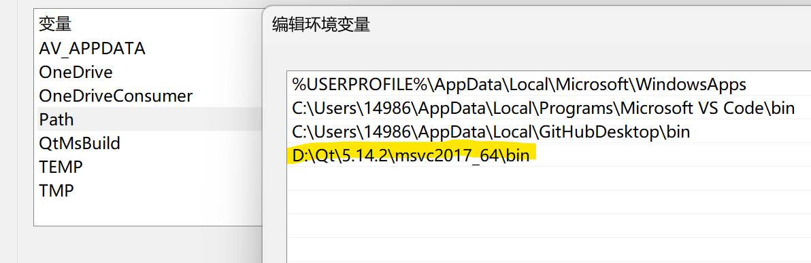
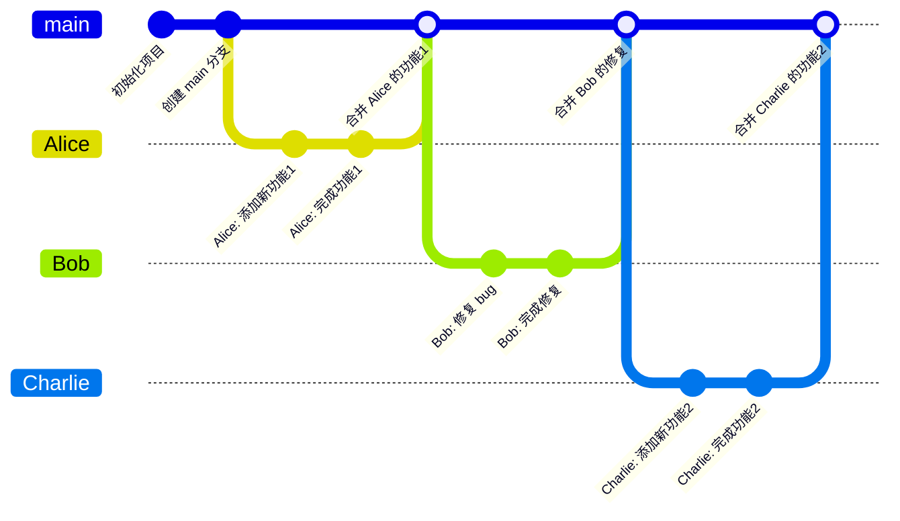

> （目前只有空文件呢，非常抱歉还没弄清楚
>
> 在最开始完全知道接口是怎么样的对我来说好像有点困难，于是决定先做一个计数器 demo，理解交互原理

## 开发环境需求


* Visual Stdio 2022
* Qt 5.14.2

配置环境：

* Visual Stdio - 下载、选择“使用C++的桌面开发”工作负载
* Qt - [下载](https://download.qt.io/archive/qt/5.14/5.14.2/) ，配置[参考链接](https://blog.csdn.net/qq_45739057/article/details/125037966)（有些可能不需要，但先这么配）
* Qt 官网下载会比较慢，但不推荐用 single 文件夹里的或者镜像（本人下了 2G 的包发现解压不了，而镜像很多版本的文件夹失效了（包括我们配置的 5.14.2）

## 如何编译运行可执行文件？

```
mkdir build
cd build
cmake .. -DCMAKE_BUILD_TYPE=Debug -G "Visual Studio 17 2022" -A x64
MSBuild ALL_BUILD.vcxproj /t:build /p:Configuration=Debug
```

### 报错解决方案

* 找不到 Qt.cmake（类似的名字

   * 在最上层的 CMakeList.txt 增加语句（你自己的相应路径） `set(CMAKE_PREFIX_PATH D:/Qt/Qt5.14.2/5.14.2/msvc2017_64/lib/cmake/Qt5)`

* 运行 .exe 文件找不到 *.dll
  
  * 增加如图所示的环境变量（用户变量） PATH
   

## git 规范

* 决定用一个仓库管理，比较方便，[仓库地址](https://github.com/smdrr11037/GoldMiner)
* 每个人在自己的分支上完成负责的部分，分支以自己的 id/名字缩写 命名，并直接推送分支到仓库
* 如果需要 merge，打开 github，创建 Pull Request（最好不要自己通过）
* 等待当前组长审核，通过后 github 会发邮件通知大家拉取新的代码
* 不需要删除旧分支，一个人的改动固定提交到该分支即可




## 命名规范

* 类名/文件名 - 帕斯卡（Pascal）命名法 `ReplacePart.cpp`
* 成员变量名 - `m_replacePart`
* .h 文件要加 `#ifndef` 等等