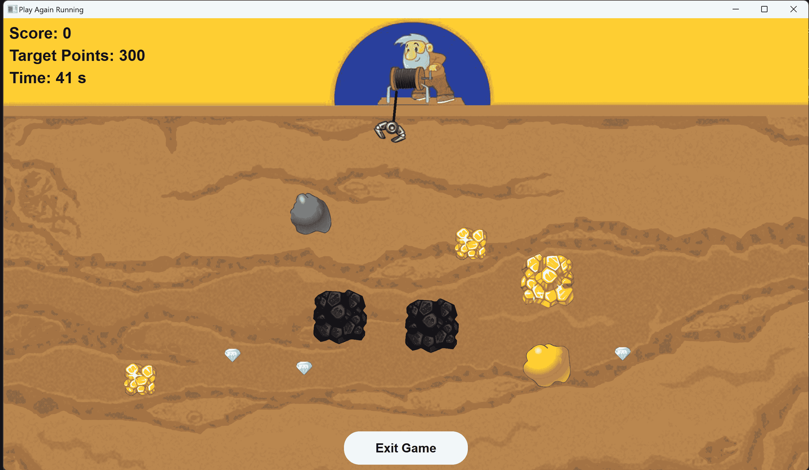
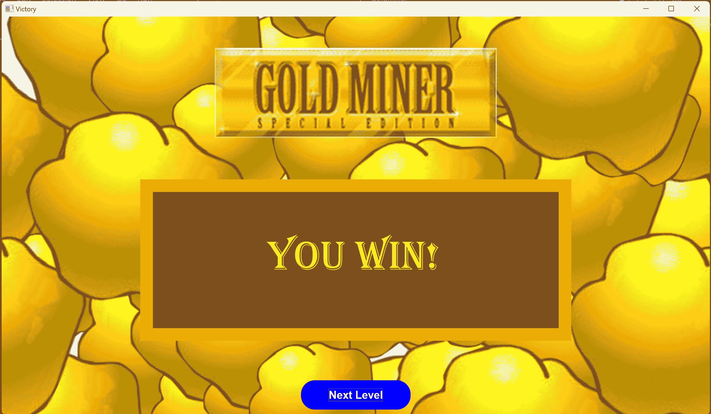

# 中期总结

---------

## 每轮迭代情况说明


- 第一轮迭代：window 实现三个窗口之间的切换，实现鼠标点击按键交互和分数等Label的显示。在 ViewModel 中加入 `Timer`，创建独立线程每隔固定时间间隔发送类似中断信号。
- 第二轮迭代：window 实现游戏中界面显示单个金块和钩子图片，初步实现绘制线条功能，并实现游戏中界面与键盘的交互。在 Model 中实现各数据的初始化，建立 Model 与 ViewModel 的信号槽连接。
- 第三轮迭代：可以根据指针暴露的 `Blocks` 属性画出地图上的所有金块，实现钩子正确旋转以及绳子与钩子末端的连接。完善 Model 层功能，包括关卡初始化、钩子与物块的移动、接收与发送信号等等，可以成功进行一轮简易游戏。
- 第四轮迭代：优化UI界面，调整参数，使游戏界面更顺畅合理。更改框架，令 Model 成为 ViewModel 的成员，数据传递改用共享指针进行暴露而非信号槽传递，将 `Timer` 与 `gameState` 转交 View 层管理。


----------

## 技术难点及克服

### 框架搭建过程中的困难

1. 环境配置问题
   
    配环境总是遇到各种各样的问题，有时候是找不到 Qt 库的 .cmake 文件，有时候是找不到 Qt 库的 .dll 文件，在搜索引擎上找了多种解决方法，最终配成了可以编译运行程序的环境。

2. 协作过程中的文件编码问题
   
    在本课程中第一次使用 visual stdio 作为 IDE，然而 visual stdio 的默认编码格式不是 UTF-8，一位组员第一次发起的 pull request 代码在一些编辑器上成了乱码，不得不改编码格式后重写注释。

3. Qt 框架下如何传递信号

    查阅资料后学习的 Qt 的信号和槽机制，用 `Qbject::connect()` 函数实现信号和槽函数的绑定。

4. 怎么实现数据绑定
   
    一开始用 Qt 的信号和槽机制实现数据绑定，老师指出接口比较难维护，于是改成 shared_ptr。

5. MVVM 框架的理解问题
   
    原本的错误理解：window 层只需要根据 model 的数据显示就行，不需要维护页面之间的转换。在实际工程中，可能是每个页面对应不同的数据和方法，即 model，因此页面之间的转换直接交给 window 层维护即可，不同的页面与不同的 model 共享数据。
    
    由于 model 层只提供数据和方法，因此每帧刷新数据的信号应由 window 层发起。


### view 层实现过程遇到的困难
1. Qt库的使用
    
    以前没有接触过Qt库，刚开始使用时显得很生涩，好在Qt库的使用并非十分困难，代码撰写过程中慢慢熟练了。

2. 不同窗口之间的切换

    起初实现窗口切换时采用三个窗口分别 setCentralWidget ，但在想要再次显示已显示窗口时应该是由于 setCentralWidget 函数的性质，会导致程序发生段错误而异常退出；

    后续采用stackedWidget来实现不同窗口的切换。

3. 布局管理器的使用
        
    需要 layout->addStretch(1) 添加弹簧，将按钮推到底部，否则页面布局会非常迥异。

4. 绘制线条（绳子）的实现

    起初想尝试用 Qt 库 QGraphicsLineItem 来实现绘制线条，但绘制出来的线条总是会携带画布，覆盖我的游戏界面；
    
    最后采用重写 QWidget 的 paintEvent 函数的方法，在现有的布局管理器中添加一条线，而不会在布局中留下额外的空白区域。

5. 键盘交互

    起初交互过程中出现无法响应键盘的情况，通过 setFocusPolicy(Qt::StrongFocus) 设置部件（widget）的焦点，用户可以直接与部件进行交互，而不需要额外的操作来激活部件的焦点。

6. 刷新页面时多个金块的重复显示
    
    刷新页面重绘所有金块和石块时，会出现“重影”，即上一次画的没有被擦除；
    
    增加 clearBlocks 函数，每次刷新页面时先调用 clearBlocks 擦除上次显示的金块。

7. 钩子旋转和绳子连接
    
    起初一直未能依靠 Qt 库函数实现：

    1. Hook 的旋转
    2. 旋转之后有一部分钩子图像无法正常显示
    3. Hook 图片旋转后钩子末端坐标改变，使得“绳子连接到钩子末端”变得难以实现

    解决方法：

    1. 创建一个新的QPixmap，用于旋转后的图像

    ```cpp
    QPixmap rotatedPixmap(w, h);
    rotatedPixmap.fill(Qt::transparent);
    QPainter painter(&rotatedPixmap);
    painter.setRenderHint(QPainter::Antialiasing, true);
    ```

    2. 将绘图原点平移到钩子末端处  
    ```cpp
    painter.translate(w/2, h / 4);
    ```
    
    3. 进行旋转  
    ```cpp
    painter.rotate(rotationAngle);
    ```
    
    4. 绘制旋转后的图像  
    
    ```cpp
    painter.drawPixmap(0, 0, hookImage);
    painter.end();
    ```
    
    5. 最后根据 Hook 坐标绘制线条，实现绳子和钩子的无缝连接。


### model 层实现过程遇到的困难

1. 起初想要自己造定时器轮子耗费了大量时间，之后阅读官方文档发现 Qt 已经提供了 `QTimer` 类，使用后发现效果更佳。
2. 花费了一定时间理解了信号槽的机制，在项目中大量使用，之后发现应当精简信号，更不应通过信号传递数据，而共享指针更适合本项目的数据传递。
3. 在最初的理解中分离了 Model 与 ViewModel，但在实际操作中发现两者的联系更为紧密，因此在后续迭代中将 Model 作为 ViewModel 的成员，ViewModel 并不向 Model 传递信号，而是直接调用 Model 的 `public` 方法，并且能够接收 Model 的信号。


--------

## 协作情况

前四轮迭代中，我们的分工如下


- 薛柔：搭建项目框架，负责 App 层
- 姚懿宸：负责 View 层和 Window 层
- 朱熙哲：负责 Model 层和 ViewModel 层


在协作过程中，我们通过 App 层指定的接口，实现了 View 层和 Model 层的同步开发。具体来说，View 层和 Model 层通过信号和槽函数进行通信，使得各部分的功能得以独立且高效地开发和测试。这种分工和协作方式不仅提高了开发效率，还确保了各模块之间的无缝衔接，最终达到了预期的开发目标。

协作过程中，我们互相交流需求，解决困难，采用 git 使得不同的代码可以方便合并，以非常高的效率完成了合作。


-------

## 部分效果图

游戏开始页面：


游戏进行中，物块可以随钩子移动：

|  |  |
| --------------------------------------------------------- | --------------------------------------------------------- |

游戏胜利和失败：

|  |  |
| --------------------------------------------------------- | --------------------------------------------------------- |

--------

## 心得体会

### 总体心得

1. **MVVM框架的优势**：MVVM框架具有良好的可测试性和解耦合性。各模块之间通过视图模型进行中介，使得视图和模型之间的耦合度降低。当一个部分发生变化时，其他部分通常不需要做出大的修改。此外，MVVM框架支持双向数据绑定，使得界面的更新更加简单高效。

2. **团队协作的重要性**：系统性团队多人协作开发软件的过程受益匪浅。团队成员之间的合作交流非常重要，为了推进前后端的同步开发，必须各自有可以测试的方式。使用工具如GitHub进行代码托管，可以方便地进行代码的版本控制，提高了合作效率，避免了传统方式中不必要的麻烦。

3. **工具的使用**：熟练使用一些协作工具如git，可以极大地提高合作效率。相比于从前使用微信反复发送压缩文件来交换代码的方式，git提供了更为高效和便捷的版本控制和代码共享方式。

4. **合理利用资源**：在项目中，尽量避免自己造轮子。遇到实现问题时，应先查询官方文档或寻找现有的解决方案。这样不仅可以节省时间，还能确保实现的功能具有稳定性和可靠性。

5. **理解和应用设计模式**：需要深入理解MVVM模式不同层间的联系，考虑各种传递信息的方法，选择最适合的方法或者结合使用，以提高代码的可读性和可维护性以及程序的性能。各成员在具体的开发过程中都体验到了这一点，并在实际工作中不断优化自己的实现方法。

总体来说，这次项目的开发不仅让我们深入理解了MVVM框架的优点，也通过实际的团队协作和工具使用，提高了我们的开发效率和项目管理能力。每个人在这个过程中都收获颇丰，为以后的项目开发打下了坚实的基础。


### 个人心得

- 姚懿宸
    1. MVVM框架有良好的可测试性，我负责的view模块只需要负责展示数据和用户交互，视图模型可以独立进行单元测试，以确保视图模型的行为符合预期。而且MVVM框架解耦合性很强，视图模型充当了视图和模型之间的中介，减少视图和模型之间的耦合，当一个部分发生变化时，其他部分通常不需要做出大的修改。数据绑定：MVVM框架支持双向数据绑定，视图可以直接与视图模型中的数据进行绑定，从而使得界面的更新更简单高效。
    2. 这是我首次经历系统性团队多人协作开发软件的过程，受益匪浅。和我们以前的团队合作不同，在采用的工具方面，Github代码托管方便了我们进行代码的版本控制，我也感受到了 git 相比于从前使用微信反复发送压缩文件来交换代码的方便和优越之处。

- 薛柔
    1. 小组间的合作交流很重要，为了推进前后端的同步开发，必须各自有可以测试的方式。
    2. 熟练使用一些工具，比如 git 可以极大地提高合作效率。

- 朱熙哲

    1. 在项目中应当尽量避免自己造轮子，遇到实现问题可以先查询官方文档寻找帮助。
    2. 需要理解 MVVM 模式不同层间的联系，考虑各种传递信息的方法，选择最适合的方法或者结合使用，以提高代码的可读性和可维护性，还有程序的性能。

